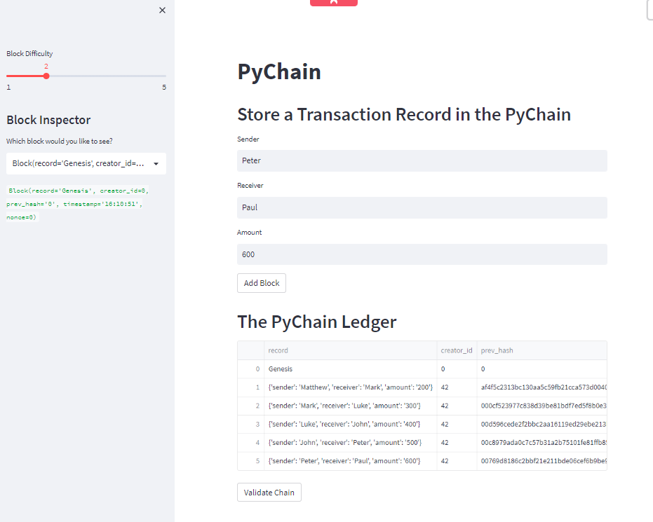
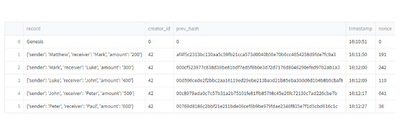
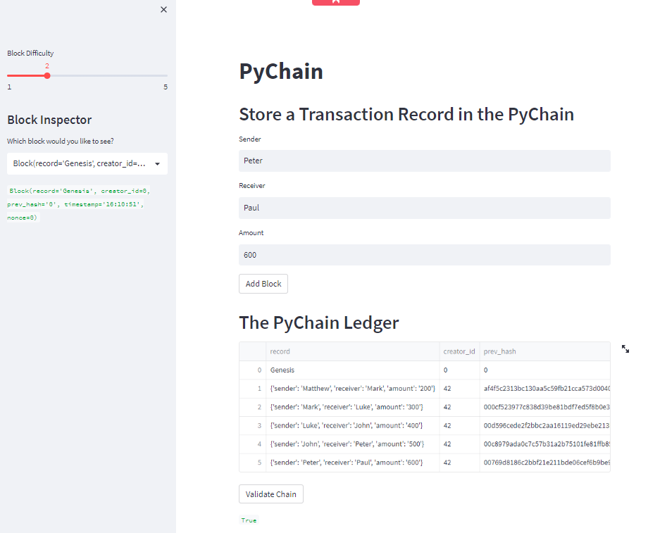

# PyChain Ledger

## Overview

As a fintech engineer working at one of the five largest banks in the world, our task was to build a blockchain-based ledger system, complete with a user-friendly web interface. This ledger should allow partner banks to conduct financial transactions (that is, to transfer money between senders and receivers) and to verify the integrity of the data in the ledger.

The following steps were performed:

1. Create a Record Data Class

2. Modify the Existing Block Data Class to Store Record Data

3. Add Relevant User Inputs to the Streamlit Interface

4. Test the PyChain Ledger by Storing Records

## Testing Overview

1. Adding value and blocks.

We entered values for the sender, receiver, and amount, and added several blocks in the ledger.

2. Validating the block contents.

We validated the Chain. As seen by the word "True" at the bottom the chain is valid. 